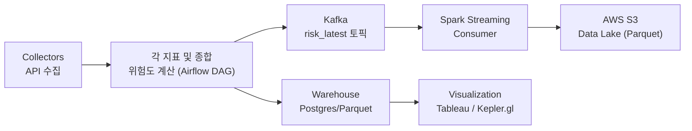

# 재해 대응을 위한 준실시간 기상 위험 **평가** 시스템  
*Near Real-time Weather Risk **Assessment** System*


> **요약**: Airflow pipeline으로 기상청 API를 1시간 단위로 수집해 **준실시간(near real-time)** 으로 위험도를 **평가/산출**하고, 이를 **Tableau**와 **kepler.gl**로 시각화합니다. 또한 Parquet + PostgreSQL 기반의 로컬 검증 구조를 유지하면서, **AWS S3 data lake**, **Spark 분석 파이프라인**, **Kafka 스트리밍**까지 확장하여 대규모 분석, 실시간 소비까지 지원하도록 설계했습니다.

---

## 목차
- [프로젝트 개요](#-프로젝트-개요)
- [프로젝트 배경](#-프로젝트-배경)
- [프로젝트 내용 요약](#-프로젝트-내용-요약)
- [데이터 구성](#-데이터-구성)
- [전체 시스템 구성](#-전체-시스템-구성)
- [결과 및 시각화](#-결과-및-시각화)
- [기술적 도전 과제](#-기술적-도전-과제)
- [인프라 및 개발 환경](#-인프라-및-개발-환경)
- [향후 확장 아이디어](#-향후-확장-아이디어)
- [기본 실행 가이드](#-기본-실행-가이드)

---

<h2>프로젝트 개요</h2>
기상 데이터를 실시간으로 수집·처리하여 태풍, UV 지수, 단기 예보 기반의 지역별 위험도를 산출하고, 이를 시각적으로 제공하는 재해 대응 시스템입니다.
Airflow 기반 데이터 파이프라인과 시각화 대시보드(Tableau, kepler.gl)를 활용하여 누구나 직관적으로 기상 위험도를 파악할 수 있도록 구현했습니다.

---

## 프로젝트 배경

기후 위기의 가속화로 태풍·집중호우·폭염과 같은 극한 기상 현상이 더 잦고 강해지고 있습니다. 재난 대응 관점에서 중요한 것은 “최대한 빠르게, 지역 단위로 위험도를 파악해 선제적으로 대응하는 것”입니다. 단순한 경보나 뉴스보다 **시간에 민감한 위험도 정보**가 실제 의사결정에 더 직접적인 도움이 됩니다.

기상청(KMA)은 초단기/단기예보, 생활기상지수(UV), 태풍 정보 등 다양한 지표를 공개하지만, 각 지표는 포맷과 단위가 제각각이고 시간축도 다르게 제공됩니다. 결과적으로 **지표를 종합해 한눈에 비교 가능한 ‘지역별 위험도’로 해석**하기 어렵고, 실무자는 매번 데이터를 풀어서 읽고 조합해야 하는 부담을 겪습니다.

또한 많은 대시보드가 수동 갱신에 의존하거나 특정 지표만 보여 주어, **최신성 확보와 종합 판단**에 한계가 있습니다. 본 프로젝트는 이러한 간극을 해소하기 위해, **1시간 주기 데이터 수집 → 지표별 위험도 계산 → 지역별 종합 위험도 산출 → 시각화**로 이어지는 흐름을 통해 **즉시 활용 가능한 형태의 위험도 정보를 제공**하는 것을 목표로 합니다. 이는 예측 모델링이 아니라 **평가/산출/모니터링**에 초점을 맞춘 접근으로, 재해 대응의 현장성과 실용성을 강화합니다.

---

## 프로젝트 내용 요약

- **데이터 파이프라인 구축**: Airflow DAG을 통해 기상청 API에서 1시간 주기로 데이터를 수집하고 전처리하도록 자동화  
- **위험도 산출 로직 구현**: 강수, 폭염, 태풍, 자외선 등 지표별 위험도 계산 함수를 개발하고, 가중합을 통해 종합 위험도(`r_total`) 산출  
- **데이터 저장소 관리**: Parquet(로컬 검증) + PostgreSQL(운영/분석) 이중 구조로 운영, UPSERT 기반 중복 없는 증분 적재 구현
- **Kafka Streaming**: Airflow에서 API 수집·위험도 산출을 수행한 뒤, 최신 스냅샷(`risk_latest`)을 **Kafka 토픽(`risk_latest`)에 JSON 이벤트로 발행**해 스트리밍 파이프라인의 입력으로 사용
- **Spark Streaming / Consumer**: Spark가 Kafka `risk_latest` 토픽을 구독하여 이벤트를 읽고, 스키마를 적용·필요한 컬럼만 선택한 뒤 **S3에 Parquet 형식으로 적재**
- **S3 Data Lake 구축**: Spark가 Kafka에서 읽어온 `risk_latest` 이벤트를 Parquet으로 S3에 쌓아, 이후 배치 분석·백필·추가 파이프라인에서 재사용 가능한 **데이터 레이크**로 운영
- **시각화 자동화**: Airflow task에서 **Hyper 파일을 생성해 Tableau Cloud와 연동**, 데이터 갱신 시 대시보드가 자동으로 최신화되도록 구성  
- **지표 품질 관리**: 데이터 최신성, 결측률, 중복률 등 KPI를 정의하고 SQL 모니터링 쿼리를 작성하여 운영 품질 확보


---

## 데이터 구성
- **출처**: 기상청 API
  - 초단기예보(기온·강수·풍속 등), 단기예보(시간별 변화)
  - 생활기상지수(UV Index), 태풍 예측(위치·거리·최대 풍속)
- **처리**: API 호출 → pandas 전처리 → `scripts/compute_risk.py`에서 지표별 위험도 함수 스코어링 및 각 지표의 가중합을 통합 위험도 계산 → `risk_latest.parquet` 생성
- **저장**: Parquet/CSV(로컬 검증 및 시각화·자동화) + **PostgreSQL**(운영/대시보드) + **AWS S3(Data Lake, Spark 분석용)**

---

## 전체 시스템 구성




(수집·위험도 산출 DAG는 1시간 주기, Streaming DAG는 동일 주기로 자동 실행)


- **Airflow DAG**: 주기 실행 · 오류 로그 · 자동 재시도(백오프)
- **타임존**: `Asia/Seoul`(KST) 기준 스케줄링

---

## 결과 및 시각화

### Tableau dashboard
- 지역별 **종합 위험도** 및 지표별 비교(UV, 강수, 풍속, 태풍 거리)
- **툴팁**에 예측 시각/원천 지표 노출
- Airflow task에서 Hyper 파일을 생성 후 Tableau Cloud와 연동하여, 데이터가 갱신될 때마다 대시보드도 자동으로 최신 상태로 반영되도록 구성
- 아래와 같이, 시간대 별로 위험도가 변화하는 모습을 확인할 수 있음
  


### kepler.gl
- 행정구역 중심 좌표를 **간단 확인용 지도**로 표시
- 필요 시 특정 시점/구간만 **보조적으로** 사용
- 아래와 같이, 현재 시각을 기준으로 한 전국 위험도를 파악할 수 있음

 시각화 전략: **Tableau 중심**(라이브 연결, 툴팁에 예측 시각·원천 지표 노출).  
> kepler.gl은 공간 분포 확인이 필요할 때 **보조적으로** 사용.

---

## 인프라 및 개발 환경
- **Python version**: Python 3.11
- **Workflow**: Apache Airflow 2.7.3 (Docker Compose)
- **Storage**: Parquet/CSV + **PostgreSQL 13** + AWS S3(Data Lake)
- **Streaming**: Kafka
- **Processing**: pandas + Spark(Pyspark)
- **Visualization**: **Tableau Public**, **kepler.gl**
- **Infrastructure**: Docker Compose + AWS S3

---
### DDL 예시 (최소 스키마)

```sql
CREATE TABLE IF NOT EXISTS risk_history_wide (
      nx            INTEGER NOT NULL,
      ny            INTEGER NOT NULL,
      admin_names   TEXT,
      base_date     DATE,
      fcst_date     DATE,
      fcst_time     TIMESTAMPTZ NOT NULL,
      source_run_at TIMESTAMPTZ NOT NULL,
      RN1           DOUBLE PRECISION,
      WSD           DOUBLE PRECISION,
      UUU           DOUBLE PRECISION,
      VVV           DOUBLE PRECISION,
      T1H           DOUBLE PRECISION,
      REH           DOUBLE PRECISION,
      PTY           DOUBLE PRECISION,
      SKY           DOUBLE PRECISION,
      UVI           DOUBLE PRECISION,
      R_rain        DOUBLE PRECISION,
      R_heat        DOUBLE PRECISION,
      R_wind        DOUBLE PRECISION,
      R_uv          DOUBLE PRECISION,
      R_typhoon     DOUBLE PRECISION,
      R_total       DOUBLE PRECISION,
      CONSTRAINT pk_rhw PRIMARY KEY (nx, ny, fcst_time)
    );
    CREATE INDEX IF NOT EXISTS idx_rhw_fcst ON risk_history_wide (fcst_time);


```

### 분석 쿼리 예시

```sql
-- 특정 격자(nx,ny)의 시계열(최근 24시간)
SELECT
  fcst_time AT TIME ZONE 'Asia/Seoul' AS fcst_kst,
  r_total, rn1, wsd, t1h, reh, pty, sky, uvi
FROM risk_history_wide
WHERE nx = 60 AND ny = 127
  AND fcst_time >= NOW() - INTERVAL '24 hours'
ORDER BY fcst_time;

```

---
## 향후 확장 아이디어
- **머신러닝 기반 예측 모델 결합**: 단순 평가 → 위험도 예측으로 확장
- **PostGIS 공간 분석 적용**: 태풍 경로와 행정구역 교차 연산으로 직접 피해 예측
- **알림 시스템**: 특정 위험도 임계값 초과 시 Slack/이메일 자동 알림

---

## 기본 실행 가이드
```bash

## 1) 리포지토리 루트에서 docker-compose.yaml 있는 폴더로
cd ./airflow

## 2) .env 생성 (Airflow 권장 UID/GID + 프로젝트 DB 연결 정보)
echo "AIRFLOW_UID=$(id -u)" > .env
echo "AIRFLOW_GID=$(id -g)" >> .env
cat >> .env <<'EOF'
# --- Project DB (Risk History) ---
PGHOST=postgres
PGPORT=5432
PGUSER=dre_user           # <- 원하는 username
PGPASSWORD=dre_pass_123   # <- 원하는 password
PGDATABASE=dre_db         # <- 원하는 DB명
EOF

## 3) 컨테이너 기동 (postgres가 먼저 떠야 아래 exec 가능)
docker compose up -d

## 4) DB USER 생성(존재하지 않을 때만)
docker compose exec -e PGPASSWORD=airflow postgres \
  psql -U airflow -d airflow -c "DO \$\$ BEGIN
    IF NOT EXISTS (SELECT FROM pg_roles WHERE rolname='dre_user') THEN
      CREATE ROLE dre_user WITH LOGIN PASSWORD 'dre_pass_123';
    END IF;
  END \$\$;"

## 5) DB 생성(존재하지 않을 때만)
docker compose exec -T -e PGPASSWORD=airflow postgres \
  bash -lc 'psql -U airflow -d postgres -tAc "SELECT 1 FROM pg_database WHERE datname='\''dre_db'\''" | grep -q 1 || \
            psql -U airflow -d postgres -c "CREATE DATABASE dre_db OWNER dre_user;"'

## 6) 생성 확인 & 접속 테스트
docker compose exec -e PGPASSWORD=airflow postgres \
  psql -U airflow -d postgres -c "\l dre_db"

docker compose exec -e PGPASSWORD=dre_pass_123 postgres \
  psql -U dre_user -d dre_db -c "SELECT now();"

## 7) (선택) 권한 이슈 대비 폴더 생성/권한 (permission denied 발생 시 예시)
chmod -R 775 ./logs ./weather_risk_assessment/data || true

```
