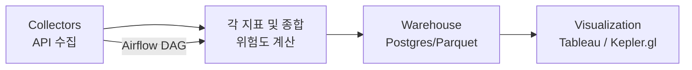

# 🌏 재해 대응을 위한 준실시간 기상 위험 **평가** 시스템  
*Near Real-time Weather Risk **Assessment** System*


> **요약 한 줄**: 기상청 API를 30분 단위로 수집해 **준실시간(near real-time)** 으로 위험도를 **평가/산출**하고, **Tableau**와 **kepler.gl**로 직관적으로 시각화합니다. 현재 **Parquet + PostgreSQL 병행 운영**으로 로컬 검증과 DB 기반 자동화를 동시에 지원하도록 하였습니다.

---

## 🗂 목차
- [프로젝트 개요](#-프로젝트-개요)
- [프로젝트 배경](#-프로젝트-배경)
- [프로젝트 내용 요약](#-프로젝트-내용-요약)
- [데이터 구성](#-데이터-구성)
- [전체 시스템 구성](#-전체-시스템-구성)
- [결과 및 시각화](#-결과-및-시각화)
- [기술적 도전 과제](#-기술적-도전-과제)
- [인프라 및 개발 환경](#-인프라-및-개발-환경)
- [PostgreSQL 도입 의의](#-postgresql-도입-의의)
- [향후 확장 아이디어](#-향후-확장-아이디어)
- [실행 가이드](#-실행-가이드)

---

<h2>📌 프로젝트 개요</h2>
기상 데이터를 실시간으로 수집·처리하여 태풍, UV 지수, 단기 예보 기반의 지역별 위험도를 산출하고, 이를 시각적으로 제공하는 재해 대응 시스템입니다.
Airflow 기반 데이터 파이프라인과 시각화 대시보드(Tableau, kepler.gl)를 활용하여 누구나 직관적으로 기상 위험도를 파악할 수 있도록 구현했습니다.

---

## 🏗 프로젝트 배경

기후 위기의 가속화로 태풍·집중호우·폭염과 같은 극한 기상 현상이 더 잦고 강해지고 있습니다. 재난 대응 관점에서 중요한 것은 “최대한 빠르게, 지역 단위로 위험도를 파악해 선제적으로 대응하는 것”입니다. 단순한 경보나 뉴스보다 **시간에 민감한 위험도 정보**가 실제 의사결정에 더 직접적인 도움이 됩니다.

기상청(KMA)은 초단기/단기예보, 생활기상지수(UV), 태풍 정보 등 다양한 지표를 공개하지만, 각 지표는 포맷과 단위가 제각각이고 시간축도 다르게 제공됩니다. 결과적으로 **지표를 종합해 한눈에 비교 가능한 ‘지역별 위험도’로 해석**하기 어렵고, 실무자는 매번 데이터를 풀어서 읽고 조합해야 하는 부담을 겪습니다.

또한 많은 대시보드가 수동 갱신에 의존하거나 특정 지표만 보여 주어, **최신성 확보와 종합 판단**에 한계가 있습니다. 본 프로젝트는 이러한 간극을 해소하기 위해, **30분 주기 데이터 수집 → 지표별 위험도 계산 → 지역별 종합 위험도 산출 → 시각화**로 이어지는 흐름을 통해 **즉시 활용 가능한 형태의 위험도 정보를 제공**하는 것을 목표로 합니다. 이는 예측 모델링이 아니라 **평가/산출/모니터링**에 초점을 맞춘 접근으로, 재해 대응의 현장성과 실용성을 강화합니다.

---

## 📑 프로젝트 내용 요약

- **데이터 파이프라인 구축**: Airflow DAG을 통해 기상청 API에서 30분 주기로 데이터를 수집하고 전처리하도록 자동화  
- **위험도 산출 로직 구현**: 강수, 폭염, 태풍, 자외선 등 지표별 위험도 계산 함수를 개발하고, 가중합을 통해 종합 위험도(`r_total`) 산출  
- **데이터 저장소 관리**: Parquet(로컬 검증) + PostgreSQL(운영/분석) 이중 구조로 운영, UPSERT 기반 중복 없는 증분 적재 구현  
- **시각화 자동화**: Airflow task에서 **Hyper 파일을 생성해 Tableau Cloud와 연동**, 데이터 갱신 시 대시보드가 자동으로 최신화되도록 구성  
- **지표 품질 관리**: 데이터 최신성, 결측률, 중복률 등 KPI를 정의하고 SQL 모니터링 쿼리를 작성하여 운영 품질 확보


---

## 📊 데이터 구성
- **출처**: 기상청 API
  - 초단기예보(기온·강수·풍속 등), 단기예보(시간별 변화)
  - 생활기상지수(UV Index), 태풍 예측(위치·거리·최대 풍속)
- **처리**: API 호출 → pandas 전처리 → `scripts/compute_risk.py`에서 지표별 위험도 함수 스코어링 및 각 지표의 가중합을 통합 위험도 계산 → `risk_latest.parquet` 생성
- **저장**: Parquet/CSV(로컬 검증 및 시각화·자동화) + **PostgreSQL**(적재)

---

## 🔧 전체 시스템 구성




(모든 단계는 Airflow DAG로 30분 주기 자동 실행)


- **Airflow DAG**: 주기 실행 · 오류 로그 · 자동 재시도(백오프)
- **타임존**: `Asia/Seoul`(KST) 기준 스케줄링

---

## 📈 결과 및 시각화

### Tableau dashboard
- 지역별 **종합 위험도** 및 지표별 비교(UV, 강수, 풍속, 태풍 거리)
- **툴팁**에 예측 시각/원천 지표 노출
- **PostgreSQL 라이브 연결**로 Airflow 갱신 시 자동 반영
- 아래와 같이, 시간대 별로 위험도가 변화하는 모습을 확인할 수 있음
  


### kepler.gl
- 행정구역 중심 좌표를 **간단 확인용 지도**로 표시
- 필요 시 특정 시점/구간만 **보조적으로** 사용
- 아래와 같이, 현재 시각을 기준으로 한 전국 위험도를 파악할 수 있음


### 운영/품질 지표 (KPI)
실제 운영에서 **신뢰성·최신성**을 보장하기 위해 아래 지표들을 모니터링합니다.

- **데이터 최신성**: `now() - max(fcst_time)`
- **커버리지**: 최신 `fcst_time` 의 (nx, ny) 수
- **결측률**: 주요 지표`(r_total, rn1, wsd, t1h, reh, pty, sky, uvi)`의 NULL 비율
- **증분 적재량**: 30분 단위 신규/갱신 row 수
- **중복 차단**: (nx,ny,fcst_time) 중복 0 유지
- **대시보드 지연**: DB 적재 시각 ↔ Tableau 반영 시각 간 차이

### SQL 예시

```sql
-- A) 파이프라인 최신성(분) & 최신 예보 리드 타임(분)
SELECT
  ROUND( (EXTRACT(EPOCH FROM (NOW() - MAX(source_run_at))) / 60.0)::numeric , 1) AS pipeline_latency_min,
  ROUND( (EXTRACT(EPOCH FROM (MAX(fcst_time) - NOW()))          / 60.0)::numeric , 1) AS latest_fcst_lead_min
FROM risk_history_wide;

-- B) 최신 fcst_time의 커버리지(그리드 수)와 로우 수
WITH m AS (SELECT MAX(fcst_time) AS ft FROM risk_history_wide)
SELECT
  (SELECT COUNT(*) FROM risk_history_wide WHERE fcst_time = (SELECT ft FROM m)) AS rows_latest_step,
  (SELECT COUNT(*) FROM (SELECT DISTINCT nx,ny FROM risk_history_wide
                         WHERE fcst_time = (SELECT ft FROM m)) g) AS grids_latest_step;

-- C) 최근 실행에 대한 주요 지표 결측률
WITH s AS (SELECT MAX(source_run_at) AS sr FROM risk_history_wide)
SELECT
  ROUND(100.0 * AVG((r_total IS NULL)::int), 2) AS r_total_null_pct,
  ROUND(100.0 * AVG((rn1     IS NULL)::int), 2) AS rn1_null_pct,
  ROUND(100.0 * AVG((wsd     IS NULL)::int), 2) AS wsd_null_pct,
  ROUND(100.0 * AVG((t1h     IS NULL)::int), 2) AS t1h_null_pct,
  ROUND(100.0 * AVG((reh     IS NULL)::int), 2) AS reh_null_pct,
  ROUND(100.0 * AVG((pty     IS NULL)::int), 2) AS pty_null_pct,
  ROUND(100.0 * AVG((sky     IS NULL)::int), 2) AS sky_null_pct,
  ROUND(100.0 * AVG((uvi     IS NULL)::int), 2) AS uvi_null_pct
FROM risk_history_wide
WHERE source_run_at = (SELECT sr FROM s);


-- D) 최근 실행에서 UPSERT 된 총 행 수
WITH s AS (SELECT MAX(source_run_at) AS sr FROM risk_history_wide)
SELECT COUNT(*) AS rows_touched_in_last_run
FROM risk_history_wide
WHERE source_run_at = (SELECT sr FROM s);


-- E) 최근 6 시간 지역별 평균 위험도
SELECT admin_names,
       ROUND(AVG(r_total)::numeric, 3) AS avg_risk_6h
FROM risk_history_wide
WHERE fcst_time >= NOW() - INTERVAL '6 hours'
GROUP BY admin_names
ORDER BY avg_risk_6h DESC
LIMIT 20;

-- F) 중복 점검(스냅샷 무시 모드에서 항상 0행이어야 정상)
SELECT nx, ny, fcst_time, COUNT(*) AS dup_cnt
FROM risk_history_wide
GROUP BY 1,2,3
HAVING COUNT(*) > 1;

```


---

## 🧭 기술적 도전 과제

| 문제(실제 이슈) | 내가 취한 접근 | 결과/효과 |
|---|---|---|
| API가 XML/JSON 등 서로 다른 포맷 + 필드 네이밍 상이 | 공통 파서(pandas 기반)와 스키마 표준화 계층을 만들고, 변환 규칙을 유닛 테스트로 고정 | 수집/전처리 코드 단순화, 스키마 일관성 확보로 후속 파이프라인 안정화 |
| 초단기/단기/UV 기준시각 불일치로 시간축( `fcstTime` ) 충돌 | `pendulum`으로 KST 고정, 라운딩·정렬 규칙 정의, 결측 보정(최근 유효값 채택) | 시간 정렬 버그 제거, 대시보드 시점 혼선 해소 |
| 행정구역 좌표(Nx, Ny) 중복/충돌로 조인 불안정 | `admin_list.csv` 정제 + **중심점 중복 제거 함수**로 `admin_code`-좌표 매핑 고정 | 조인 키 일관성 확보, 지역별 집계의 신뢰도 향상 |
| 파일만 사용할 때 중복/버전 관리 어려움 | **PostgreSQL 도입** + PK/인덱스 설계, **UPSERT**로 증분 갱신 | 30분 주기 갱신 시 중복 없이 최신 상태 유지, 쿼리 탐색성 개선 |
| Airflow 태스크 부분 실패가 전체 DAG 실패로 전파 | 태스크 세분화·의존 최소화, 재시도/백오프, 네트워크 타임아웃·리트라이 설정 | 간헐적 API 장애에도 파이프라인 복원력↑ |
| Tableau가 수동 새로고침 의존 | Tableau ↔ PostgreSQL **라이브 연결** 전환(스케줄 새로고침) | Airflow 갱신 → 대시보드 자동 반영(운영 부담↓) |
| 지표 단위/스케일 불일치(UV·강수·풍속·태풍 거리 혼재) | 지표별 **위험도 계산 함수**를 구현하고, 이를 통해 스코어링한 뒤, 각 지표별 가중치를 반영한 통합 위험도(`r_total`) 계산** | 지표 해석의 일관성·비교 가능성 확보, 외부 설정 파일 의존 없음 |
| 로컬 검증과 운영 데이터 소스가 달라 재현성 저하 | **Parquet + DB 병행** 운영: Parquet(로컬 검증/백업), DB(운영/시각화) | 개발-운영 격차 축소, 빠른 로컬 디버깅 가능 |
| Airflow 재실행 등으로 인한 DB 예보 누적/중복 | UNIQUE (nx,ny,fcst_time) + ON CONFLICT ... DO UPDATE(단, EXCLUDED.source_run_at >= 기존일 때만 갱신) 등 조건을 설정함 | 겹치는 단계는 업데이트, 새 단계만 INSERT → 30분 주기 증분화, 행 수 예측 가능 |

> 시각화 전략: **Tableau 중심**(라이브 연결, 툴팁에 예측 시각·원천 지표 노출).  
> kepler.gl은 공간 분포 확인이 필요할 때 **보조적으로** 사용.

---

## 🖥 인프라 및 개발 환경
- **Python version**: Python 3.11
- **Workflow**: Apache Airflow 2.7.3 (Docker Compose)
- **Storage**: Parquet/CSV + **PostgreSQL 13**
- **Visualization**: **Tableau Public**, **kepler.gl**

---

## 🗄 PostgreSQL 도입 의의

**왜 DB까지?** 파일 대비 **무결성/자동화/확장성**에서 장점이 큽니다.

- **데이터 관리/무결성**: PK·Index 기반으로 **중복 제어/품질 보장**
- **업서트(UPSERT)**: 30분 주기 갱신 시 **중복 없이 최신화**
- **SQL 탐색성**: 조건/집계/조인 기반 **즉시 분석**
- **지리공간 확장에 용이(PostGIS)**: 태풍 경로/버퍼/폴리곤 교차 등 **공간 분석** 고도화

### DDL 예시 (최소 스키마)

```sql
CREATE TABLE IF NOT EXISTS risk_history_wide (
      nx            INTEGER NOT NULL,
      ny            INTEGER NOT NULL,
      admin_names   TEXT,
      base_date     DATE,
      fcst_date     DATE,
      fcst_time     TIMESTAMPTZ NOT NULL,
      source_run_at TIMESTAMPTZ NOT NULL,
      RN1           DOUBLE PRECISION,
      WSD           DOUBLE PRECISION,
      UUU           DOUBLE PRECISION,
      VVV           DOUBLE PRECISION,
      T1H           DOUBLE PRECISION,
      REH           DOUBLE PRECISION,
      PTY           DOUBLE PRECISION,
      SKY           DOUBLE PRECISION,
      UVI           DOUBLE PRECISION,
      R_rain        DOUBLE PRECISION,
      R_heat        DOUBLE PRECISION,
      R_wind        DOUBLE PRECISION,
      R_uv          DOUBLE PRECISION,
      R_typhoon     DOUBLE PRECISION,
      R_total       DOUBLE PRECISION,
      CONSTRAINT pk_rhw PRIMARY KEY (nx, ny, fcst_time)
    );
    CREATE INDEX IF NOT EXISTS idx_rhw_fcst ON risk_history_wide (fcst_time);


```

### 분석 쿼리 예시

```sql
-- 특정 격자(nx,ny)의 시계열(최근 24시간)
SELECT
  fcst_time AT TIME ZONE 'Asia/Seoul' AS fcst_kst,
  r_total, rn1, wsd, t1h, reh, pty, sky, uvi
FROM risk_history_wide
WHERE nx = 60 AND ny = 127
  AND fcst_time >= NOW() - INTERVAL '24 hours'
ORDER BY fcst_time;

```

---
## 🔮 향후 확장 아이디어
- **머신러닝 기반 예측 모델 결합**: 단순 평가 → 위험도 예측으로 확장
- **PostGIS 공간 분석 적용**: 태풍 경로와 행정구역 교차 연산으로 직접 피해 예측
- **알림 시스템**: 특정 위험도 임계값 초과 시 Slack/이메일 자동 알림
- **클라우드 배포**: AWS/GCP 상에서 서버리스 형태로 실행


---

## 📝 실행 가이드
```bash

## 1) 리포지토리 루트에서 docker-compose.yaml 있는 폴더로
cd ./airflow

## 2) .env 생성 (Airflow 권장 UID/GID + 프로젝트 DB 연결 정보)
echo "AIRFLOW_UID=$(id -u)" > .env
echo "AIRFLOW_GID=$(id -g)" >> .env
cat >> .env <<'EOF'
# --- Project DB (Risk History) ---
PGHOST=postgres
PGPORT=5432
PGUSER=dre_user           # <- 원하는 username
PGPASSWORD=dre_pass_123   # <- 원하는 password
PGDATABASE=dre_db         # <- 원하는 DB명
EOF

## 3) 컨테이너 기동 (postgres가 먼저 떠야 아래 exec 가능)
docker compose up -d

## 4) DB USER 생성(존재하지 않을 때만)
docker compose exec -e PGPASSWORD=airflow postgres \
  psql -U airflow -d airflow -c "DO \$\$ BEGIN
    IF NOT EXISTS (SELECT FROM pg_roles WHERE rolname='dre_user') THEN
      CREATE ROLE dre_user WITH LOGIN PASSWORD 'dre_pass_123';
    END IF;
  END \$\$;"

## 5) DB 생성(존재하지 않을 때만)
docker compose exec -T -e PGPASSWORD=airflow postgres \
  bash -lc 'psql -U airflow -d postgres -tAc "SELECT 1 FROM pg_database WHERE datname='\''dre_db'\''" | grep -q 1 || \
            psql -U airflow -d postgres -c "CREATE DATABASE dre_db OWNER dre_user;"'

## 6) 생성 확인 & 접속 테스트
docker compose exec -e PGPASSWORD=airflow postgres \
  psql -U airflow -d postgres -c "\l dre_db"

docker compose exec -e PGPASSWORD=dre_pass_123 postgres \
  psql -U dre_user -d dre_db -c "SELECT now();"

## 7) (선택) 권한 이슈 대비 폴더 생성/권한 (permission denied 발생 시 예시)
chmod -R 775 ./logs ./weather_risk_assessment/data || true

```
