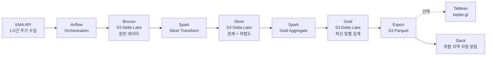

# 재해 대응을 위한 준실시간 기상 위험 평가 시스템
*Near Real-time Weather Risk Assessment System*


> **요약**: 기상청(KMA) API를 1시간 주기로 수집하여 지역별 기상 위험도를 자동 산출하는 파이프라인입니다. 수집된 데이터는 AWS S3 Delta Lake에 Medallion Architecture(Bronze → Silver → Gold)로 적재되며, Spark를 통해 단계별로 정제·집계됩니다. 위험도가 임계값을 초과하면 **Slack으로 자동 알림**이 전송됩니다. 산출된 결과는 S3 Parquet으로 Export되며, **Tableau · kepler.gl을 통한 시각화를 선택적으로 연계**할 수 있습니다.

---

## 목차
- [프로젝트 개요](#프로젝트-개요)
- [프로젝트 배경](#프로젝트-배경)
- [프로젝트 내용 요약](#프로젝트-내용-요약)
- [데이터 구성](#데이터-구성)
- [전체 시스템 구성](#전체-시스템-구성)
- [결과 및 시각화](#결과-및-시각화)
- [기술적 도전 과제](#기술적-도전-과제)
- [인프라 및 개발 환경](#인프라-및-개발-환경)
- [향후 확장 아이디어](#향후-확장-아이디어)
- [기본 실행 가이드](#기본-실행-가이드)

---

## 프로젝트 개요

기상 데이터를 준실시간으로 수집·처리하여 태풍, UV 지수, 강수, 폭염, 바람 등 복합 지표 기반의 지역별 위험도를 산출하는 재해 대응 시스템입니다. Airflow 기반 데이터 파이프라인과 Slack 자동 알림을 통해 위험 상황을 즉시 인지하고 대응할 수 있습니다. 파이프라인 최종 산출물은 S3 Parquet으로 Export되며, Tableau · kepler.gl 등의 시각화 도구와 선택적으로 연계할 수 있도록 설계되었습니다.

---

## 프로젝트 배경

기후 위기의 가속화로 태풍·집중호우·폭염과 같은 극한 기상 현상이 더 잦고 강해지고 있습니다. 재난 대응 관점에서 중요한 것은 "최대한 빠르게, 지역 단위로 위험도를 파악해 선제적으로 대응하는 것"입니다.

기상청(KMA)은 초단기/단기예보, 생활기상지수(UV), 태풍 정보 등 다양한 지표를 공개하지만, 각 지표는 포맷과 단위가 제각각이고 시간축도 다르게 제공됩니다. **지표를 종합해 한눈에 비교 가능한 '지역별 위험도'로 해석**하기 어렵고, 실무자는 매번 데이터를 풀어서 읽고 조합해야 하는 부담이 있습니다.

본 프로젝트는 **1시간 주기 수집 → 위험도 산출 → S3 Delta Lake 적재 → 위험 지역 자동 알림 → 시각화**로 이어지는 흐름을 통해 즉시 활용 가능한 위험도 정보를 제공하는 것을 목표로 합니다.

---

## 프로젝트 내용 요약

- **데이터 파이프라인 구축**: Airflow DAG을 통해 기상청 API에서 1시간 주기로 데이터를 수집하고 원천 데이터를 표준 스키마로 정제
- **위험도 산출 로직 구현**: 강수, 폭염, 태풍, 자외선, 바람 등 지표별 위험도 계산 함수를 개발하고, 가중합과 최고값 기반으로 종합 위험도(`R_total`) 산출. 가중치는 `risk/config.py` 단일 파일에서 중앙 관리
- **Medallion Architecture**: 수집 데이터를 AWS S3 Delta Lake에 Bronze(원천) → Silver(정제·위험도) → Gold(집계·최신) 단계로 누적 저장하여 원천 보존과 단계별 재처리(backfill) 가능
- **Spark 기반 데이터 처리**: Silver/Gold 단계 변환 및 집계를 PySpark로 처리. `mapInPandas`를 활용해 기존 pandas 기반 위험도 함수를 Spark 파이프라인에 통합
- **Slack 자동 알림**: 파이프라인 완료 후 `R_total ≥ 0.6` (HIGH 이상) 지역이 감지되면 Slack Webhook으로 자동 알림 전송. 위험 지역 없을 시에도 "안전" 알림으로 파이프라인 정상 동작을 확인
- **시각화 연계** *(선택)*: 파이프라인이 Export한 Parquet을 Tableau · kepler.gl에 연결하여 지역별·시간대별 위험도 변화를 직관적으로 확인 가능. DAG 내 Tableau 게시 태스크는 주석 처리되어 있으며, 필요 시 `.env`에 `TABLEAU_*` 환경변수를 설정해 활성화할 수 있음
- **품질 및 신뢰성**: KST 시간 정렬, 결측치 처리, 중복 방지 로직을 통해 산출 결과의 일관성 유지

---

## 데이터 구성

- **출처**: 기상청 Open API
  - 초단기예보 (기온·강수·풍속 등)
  - 단기예보 (강수확률·하늘상태 등)
  - 생활기상지수 (UV Index)
  - 태풍 예측 (위치·거리·최대 풍속)

- **처리 흐름**:
  ```
  API 수집 → Bronze(S3) → Spark Silver(정제·위험도 산출) → Spark Gold(집계) → Export Parquet
  ```

- **위험도 계산 공식**:
  ```
  R_total = 0.7 × peak + 0.3 × weighted_avg
  가중치: 강수 28% | 바람 22% | 태풍 20% | 폭염 18% | UV 12%
  ```

- **저장**: AWS S3 Delta Lake (Bronze / Silver / Gold / Export)

---

## 전체 시스템 구성


```mermaid
flowchart LR
  A["KMA API<br>1시간 주기 수집"] --> B["Airflow<br>Orchestration"]
  B --> C["Bronze<br>S3 Delta Lake<br>원천 데이터"]
  C --> D["Spark<br>Silver Transform"]
  D --> E["Silver<br>S3 Delta Lake<br>정제 + 위험도"]
  E --> F["Spark<br>Gold Aggregate"]
  F --> G["Gold<br>S3 Delta Lake<br>최신·일별 집계"]
  G --> H["Export<br>S3 Parquet"]
  H -.->|선택| V["Tableau<br>kepler.gl"]
  H --> S["Slack<br>위험 지역 자동 알림"]
```

- **Airflow DAG**: 1시간 주기 실행, 오류 시 자동 재시도(백오프)
- **타임존**: `Asia/Seoul`(KST) 기준 스케줄링
- **Slack 알림**: HIGH(`≥0.6`) / VERY_HIGH(`≥0.8`) 지역 감지 시 자동 전송

---

## 결과 및 시각화

### Slack 알림
파이프라인 완료 후 위험도 임계값을 초과한 지역이 발생하면 자동으로 알림이 전송됩니다.

```
🚨 기상 위험 지역 알림
🔴 *강원도 강릉시*  |  위험도: 0.83 (VERY_HIGH)  |  예보: 2025-08-10 14:00
🟠 *경상남도 창원시*  |  위험도: 0.67 (HIGH)  |  예보: 2025-08-10 14:00
```

위험 지역이 없을 경우:
```
✅ 기상 위험 알림 | 현재 위험 지역 없음
```

### Tableau 대시보드 *(선택적 연계)*
Export된 Parquet을 Tableau에 연결하여 사용합니다. DAG의 `csv_to_hyper` / `publish_overwrite` 태스크는 기본적으로 비활성화 상태이며, `.env`에 `TABLEAU_*` 환경변수를 설정하면 Tableau Cloud에 자동 게시됩니다.

- 지역별 **종합 위험도** 및 지표별 비교 (UV, 강수, 풍속, 태풍 거리)
- **툴팁**에 예측 시각 및 원천 지표 노출


### kepler.gl *(선택적 연계)*
Export된 Parquet을 kepler.gl에 드래그&드롭하여 즉시 시각화할 수 있습니다.

- 행정구역 중심 좌표 기반 **지리 공간 시각화**
- 전국 위험도 분포를 지도 위에서 직관적으로 확인


### 품질 검증 지표

파이프라인의 신뢰성을 확인하기 위해 아래 지표를 기준으로 데이터 품질을 점검합니다.

| 지표 | 설명 |
|---|---|
| 데이터 최신성 | `now() - max(fcst_time)` |
| 커버리지 | 최신 `fcst_time`의 (nx, ny) 그리드 수 |
| 결측률 | 주요 지표 (`R_total`, `RN1`, `WSD`, `T1H` 등) NULL 비율 |
| 증분 적재량 | 1시간 단위 신규/갱신 row 수 |
| 중복 차단 | (nx, ny, fcst_time) 중복 0 유지 |

---

## 기술적 도전 과제

| 문제 | 접근 방식 | 결과 |
|---|---|---|
| API마다 포맷·필드명 상이 (XML/JSON 혼재) | 공통 파서와 스키마 표준화 계층 구현 | 수집/전처리 단순화, 후속 파이프라인 안정화 |
| 초단기/단기/UV 기준시각 불일치로 시간축 충돌 | `pendulum`으로 KST 고정, 라운딩·정렬 규칙 정의, 결측 보정 | 시간 정렬 버그 제거 |
| 행정구역 좌표(Nx, Ny) 중복·충돌로 조인 불안정 | `admin_centroids.csv` 정제 + 중심점 중복 제거 함수로 좌표 매핑 고정 | 조인 키 일관성 확보 |
| 지표 단위·스케일 불일치 (UV·강수·풍속·태풍 혼재) | 지표별 위험도 함수 구현 후 가중합으로 `R_total` 산출. 가중치를 `risk/config.py`에 중앙화하여 Spark/로컬 경로 모두 단일 소스 공유 | 지표 일관성 확보, 유지보수성 향상 |
| pandas 기반 위험도 함수를 Spark에 통합 | `mapInPandas`로 파티션 단위 pandas 함수 실행 | 기존 로직 재사용하면서 분산 처리 가능 |
| Airflow 태스크 부분 실패가 전체 DAG 실패로 전파 | 태스크 세분화·의존 최소화, 재시도/백오프, 네트워크 타임아웃 설정 | 간헐적 API 장애에도 파이프라인 복원력 향상 |
| 위험 상황 인지 지연 | 파이프라인 완료 후 `R_total ≥ 0.6` 지역을 감지해 Slack Webhook으로 자동 알림 | 위험 발생 즉시 담당자 인지 가능 |

---

## 인프라 및 개발 환경

- **Python**: 3.11
- **Workflow**: Apache Airflow 2.7.3 (Docker Compose, CeleryExecutor)
- **Processing**: pandas + PySpark 3.5.1
- **Storage**: AWS S3 Delta Lake (Medallion Architecture)
- **Alert**: Slack Incoming Webhook
- **Visualization** *(optional)*: Tableau, kepler.gl
- **Infrastructure**: Docker Compose + AWS S3

---

## 향후 확장 아이디어

- **머신러닝 기반 예측 모델 결합**: 단순 평가 → 위험도 예측으로 확장
- **PostGIS 공간 분석 적용**: 태풍 경로와 행정구역 교차 연산으로 직접 피해 범위 예측
- **REST API 레이어 추가**: FastAPI로 위험도 데이터를 외부 서비스에 제공

---

## 기본 실행 가이드

```bash
# 1) 저장소 클론
git clone <YOUR_REPO_URL>
cd weather-risk-assessment

# 2) .env 생성 (.env.example 참고)
cp .env.example .env
# .env 파일에 KMA_API_KEY, AWS 키, S3 버킷명, Slack Webhook URL 입력

# 3) Airflow 컨테이너 실행
cd docker
docker compose up -d

# 4) Airflow UI 접속
# http://localhost:8080  (ID: airflow / PW: airflow)
# weather_risk_assessment DAG 활성화 후 실행
```
