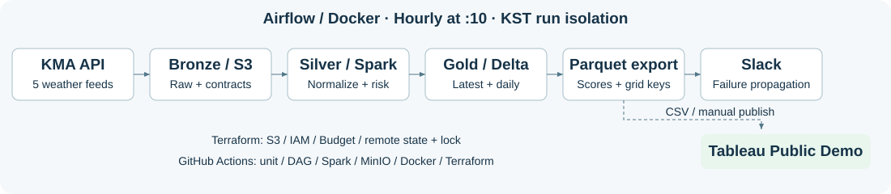
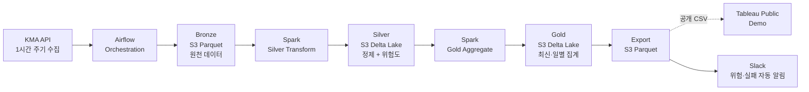
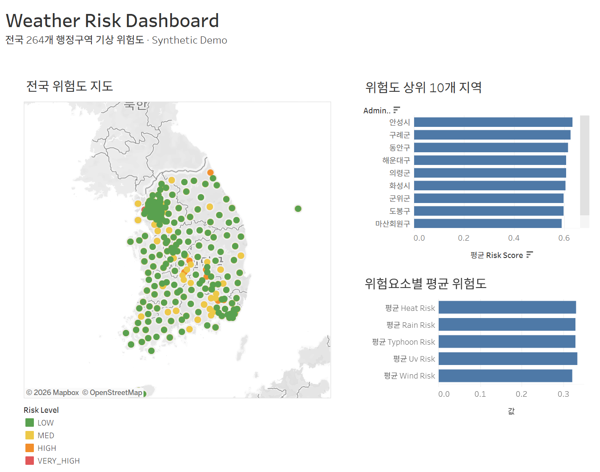

# 재해 대응을 위한 준실시간 기상 위험도 산출 파이프라인
*Near Real-time Weather Risk Scoring Pipeline*


> **요약**: 기상청(KMA) API를 1시간 주기로 수집하여 지역별 기상 위험도를 자동 산출하는 파이프라인입니다. 수집된 데이터는 AWS S3의 Medallion Architecture(Bronze → Silver → Gold)에 적재되며, Bronze 원천 데이터와 Silver·Gold Delta Lake를 Spark로 단계별 정제·집계합니다. 위험도가 임계값을 초과하면 **Slack으로 자동 알림**이 전송됩니다. 산출된 결과는 S3 Parquet으로 Export되며, 공개 가능한 CSV로 변환해 **Tableau Public 대시보드**로 시각화할 수 있습니다.

---

## 유지보수 문서

- [폴더 구조와 데이터 경로](docs/architecture.md)
- [개발 환경·운영 안내·점검 결과](docs/maintenance.md)
- [Bronze 데이터 계약](docs/data-contracts.md)
- [Terraform AWS 인프라](infra/terraform/README.md)
- [AI 작업 지침](AGENTS.md)

## 프로젝트 개요

기상 데이터를 준실시간으로 수집·처리하여 태풍, UV 지수, 강수, 폭염, 바람 등 복합 지표 기반의 지역별 위험도를 산출하는 재해 대응 시스템입니다. Airflow 기반 데이터 파이프라인과 Slack 자동 알림을 통해 위험 상황을 즉시 인지하고 대응할 수 있습니다. 파이프라인 최종 산출물은 S3 Parquet으로 Export되며, Tableau Public 데모를 위한 공개용 CSV로 변환할 수 있습니다.

---

## 프로젝트 배경

기후 위기의 가속화로 태풍·집중호우·폭염과 같은 극한 기상 현상이 더 잦고 강해지고 있습니다. 재난 대응 관점에서 중요한 것은 "최대한 빠르게, 지역 단위로 위험도를 파악해 선제적으로 대응하는 것"입니다.

기상청(KMA)은 초단기/단기예보, 생활기상지수(UV), 태풍 정보 등 다양한 지표를 공개하지만, 각 지표는 포맷과 단위가 제각각이고 시간축도 다르게 제공됩니다. **지표를 종합해 한눈에 비교 가능한 '지역별 위험도'로 해석**하기 어렵고, 실무자는 매번 데이터를 풀어서 읽고 조합해야 하는 부담이 있습니다.

본 프로젝트는 **수집 → 위험도 산출 → S3 Delta Lake 적재 → 위험 지역 자동 알림 → 시각화**로 이어지는 흐름을 통해 즉시 활용 가능한 위험도 정보를 제공하는 것을 목표로 합니다.

---

## 프로젝트 내용 요약

- **데이터 파이프라인 구축**: Airflow DAG을 통해 기상청 API에서 데이터를 수집하고 원천 데이터를 표준 스키마로 정제
- **위험도 산출 로직 구현**: 강수, 폭염, 태풍, 자외선, 바람 등 지표별 위험도 계산 함수를 개발하고, 가중합과 최고값 기반으로 종합 위험도(`R_total`) 산출. 가중치는 `risk/config.py` 단일 파일에서 중앙 관리
- **Medallion Architecture**: 수집 데이터를 AWS S3의 Bronze Parquet(원천) → Silver·Gold Delta Lake(정제·위험도·집계) 단계로 저장하여 원천 보존과 단계별 재처리(backfill) 가능
- **Spark 기반 데이터 처리**: Silver/Gold 단계 변환 및 집계를 PySpark로 처리. `mapInPandas`를 활용해 기존 pandas 기반 위험도 함수를 Spark 파이프라인에 통합
- **Slack 자동 알림**: 파이프라인 완료 후 `R_total ≥ 0.6` (HIGH 이상) 지역을 알리고, 최종 재시도 후 실패한 태스크는 실행·로그 정보와 함께 통지. 위험 지역 없을 시에도 "안전" 알림으로 정상 동작을 확인
- **시각화 데모** *(선택)*: Export한 Parquet을 공개용 CSV로 변환해 Tableau Public에서 지역별 종합·지표별 위험도를 시각화. 계정 인증과 게시는 운영 DAG에서 분리

---

## 데이터 구성

- **출처**: 기상청 Open API
  - 초단기예보 (기온·강수·풍속 등)
  - 단기예보 (강수확률·하늘상태 등)
  - 생활기상지수 (UV Index)
  - 태풍 예측 (위치·거리·최대 풍속)

- **처리 흐름**:
  ```
  API 수집 → Bronze(S3) → Spark Silver(정제·위험도 산출) → Spark Gold(집계) → Export Parquet
  ```

- **위험도 계산 공식**:
  ```
  R_total = 0.7 × peak + 0.3 × weighted_avg
  가중치: 강수 28% | 바람 22% | 태풍 20% | 폭염 18% | UV 12%
  ```

- **저장**: AWS S3 (Bronze·Export Parquet / Silver·Gold Delta Lake)

---

## 전체 시스템 구성




```mermaid
flowchart LR
  A["KMA API<br>1시간 주기 수집"] --> B["Airflow<br>Orchestration"]
  B --> C["Bronze<br>S3 Parquet<br>원천 데이터"]
  C --> D["Spark<br>Silver Transform"]
  D --> E["Silver<br>S3 Delta Lake<br>정제 + 위험도"]
  E --> F["Spark<br>Gold Aggregate"]
  F --> G["Gold<br>S3 Delta Lake<br>최신·일별 집계"]
  G --> H["Export<br>S3 Parquet"]
  H -.->|공개 CSV| V["Tableau Public<br>Demo"]
  H --> S["Slack<br>위험·실패 자동 알림"]
```

- **Airflow DAG**: 매시 10분 자동 실행(`10 * * * *`), 실패 작업은 5분 간격으로 최대 2회 재시도하고 실행 전체를 55분으로 제한
- **타임존**: `Asia/Seoul`(KST) 기준 시각 처리
- **Slack 알림**: HIGH(`≥0.6`) / VERY_HIGH(`≥0.8`) 지역과 최종 실패 태스크를 자동 전송

---

## 결과 및 시각화

### Slack 알림
파이프라인 완료 후 위험도 임계값을 초과한 지역이 발생하면 자동으로 알림이 전송됩니다.

```
🚨 기상 위험 지역 알림 (예시)
🔴 *강원도 강릉시*  |  위험도: 0.83 (VERY_HIGH)  |  예보: 2025-08-10 14:00
🟠 *경상남도 창원시*  |  위험도: 0.67 (HIGH)  |  예보: 2025-08-10 14:00
```

위험 지역이 없을 경우:
```
✅ 기상 위험 알림 | 현재 위험 지역 없음
```

### Tableau Public 대시보드 *(Demo)*
Export된 Parquet에 행정구역 대표 좌표를 결합해 Tableau Public용 CSV를 만듭니다. Tableau 계정과 게시 과정은 운영 DAG에서 분리하며, 생성된 CSV는 무료 웹 편집기에 별도로 게시합니다.

- 지역별 **종합 위험도** 및 지표별 비교 (UV, 강수, 바람, 폭염, 태풍)
- **툴팁**에 예측 시각 및 위험도 구성요소 노출
- [Tableau Public에서 대시보드 열기](https://public.tableau.com/views/WeatherRiskDashboard_17900819962470/WeatherRiskDashboard?:showVizHome=no)

[](https://public.tableau.com/views/WeatherRiskDashboard_17900819962470/WeatherRiskDashboard?:showVizHome=no)

---

## 기술적 도전 과제

### 안정성 및 운영 기반 개선

- **실행 격리·시간 정합성**: KST 실행 식별자를 수집부터 Silver까지 전달하고 실행별 저장 경로를 분리해 이전 실행 데이터의 혼입을 방지했습니다. 고정 행정구역 산출물은 원본이나 생성 코드가 바뀔 때만 갱신합니다.
- **데이터 품질 계약**: KMA 정상·오류 응답 fixture와 Bronze/Silver/Gold 검증으로 필수 컬럼, 키 중복, 시각, 위험도 범위 오류를 저장 전에 차단합니다. 실행 시각보다 4시간을 초과해 오래된 발표본도 S3 업로드 전에 거부합니다.
- **재현 가능한 실행·CI**: 런타임 의존성을 잠그고 GitHub Actions에서 단위 테스트, DAG import, Spark 변환, MinIO S3 통합, Docker 빌드와 Terraform 검증을 수행합니다.
- **AWS 인프라 코드화**: Terraform으로 S3 보안·수명주기, 최소 권한 IAM 정책, 비용 Budget을 구성하고 S3 원격 state와 잠금을 적용했습니다.
- **실패 감지·시각화**: 장기 실행을 55분에 종료하고 최종 실패 태스크를 Slack으로 알립니다. 웹훅 주소가 네트워크 오류에 노출되지 않도록 처리했으며 Tableau Public Demo를 공개했습니다. 게시 데이터는 264개 지점 × 8개 시각의 합성 데이터입니다.

Airflow가 실행 중이면 **1시간 주기 자동 수집·처리·알림**을 수행합니다. 상시 운영을 위한 CD는 실제 배포 대상이 정해질 때 추가합니다. Tableau Demo는 실제 예보의 자동 갱신을 의미하지 않습니다.

| 문제 | 접근 방식 | 결과 |
|---|---|---|
| API마다 포맷·필드명 상이 (XML/JSON 혼재) | 공통 파서와 스키마 표준화 계층 구현 | 수집/전처리 단순화, 후속 파이프라인 안정화 |
| 초단기/단기/UV 기준시각 불일치로 시간축 충돌 | `pendulum`으로 KST 고정, 라운딩·정렬 규칙 정의, 결측 보정 | 시간 정렬 버그 제거 |
| 행정구역 좌표(Nx, Ny) 중복·충돌로 조인 불안정 | `admin_centroids.csv` 정제 + 중심점 중복 제거 함수로 좌표 매핑 고정 | 조인 키 일관성 확보 |
| 지표 단위·스케일 불일치 (UV·강수·풍속·태풍 혼재) | 지표별 위험도 함수 구현 후 가중합으로 `R_total` 산출. 가중치를 `risk/config.py`에 중앙화하여 Spark/로컬 경로 모두 단일 소스 공유 | 지표 일관성 확보, 유지보수성 향상 |
| Airflow 태스크 부분 실패가 전체 DAG 실패로 전파 | 태스크 세분화, 일부 수집기의 요청 재시도, 네트워크 타임아웃 설정 | 간헐적 API 장애에도 파이프라인 복원력 향상 |
| 위험 상황 인지 지연 | 파이프라인 완료 후 `R_total ≥ 0.6` 지역을 감지해 Slack Webhook으로 자동 알림 | 위험 발생 즉시 담당자 인지 가능 |
| Spark에서 S3 Delta Lake 연동 설정 복잡 | `hadoop-aws`, `aws-java-sdk-bundle` 패키지 버전 충돌 해결 및 `spark.sql.extensions`, `spark.sql.catalog` 등 Delta 관련 conf를 `spark-submit` 옵션으로 통일하여 DAG에서 일관되게 관리 | S3 Delta Lake 읽기/쓰기 안정화 |

---

## 인프라 및 개발 환경

- **Python**: 3.11
- **Workflow**: Apache Airflow 2.7.3 (Docker Compose)
- **Processing**: pandas + PySpark 3.5.1
- **Storage**: AWS S3 Parquet + Delta Lake (Medallion Architecture)
- **Alert**: Slack Incoming Webhook
- **Visualization** *(demo)*: Tableau Public
- **Infrastructure**: Docker Compose + Terraform (AWS S3 · IAM · Budgets)

---

## 향후 확장 아이디어

- **머신러닝 기반 예측 모델 결합**: 단순 평가 → 위험도 예측으로 확장
- **PostGIS 공간 분석 적용**: 태풍 경로와 행정구역 교차 연산으로 직접 피해 범위 예측
- **REST API 레이어 추가**: FastAPI로 위험도 데이터를 외부 서비스에 제공

---

## 기본 실행 가이드

```bash
# 1) 저장소 클론
git clone <YOUR_REPO_URL>
cd weather-risk-assessment

# 2) .env 생성 (.env.example 참고)
cp .env.example .env
# .env 파일에 KMA_API_KEY, AWS 키, S3 버킷명, Slack Webhook URL 입력

# 3) Airflow 컨테이너 실행
unzip data/border/N3A_G0100000.zip -d data/border
docker compose --env-file .env -f docker/docker-compose.yaml up -d --build

# 4) Airflow UI 접속
# http://localhost:8080  (ID: airflow / PW: airflow)
# weather_risk_assessment DAG를 활성화하면 매시 10분 자동 실행
```
